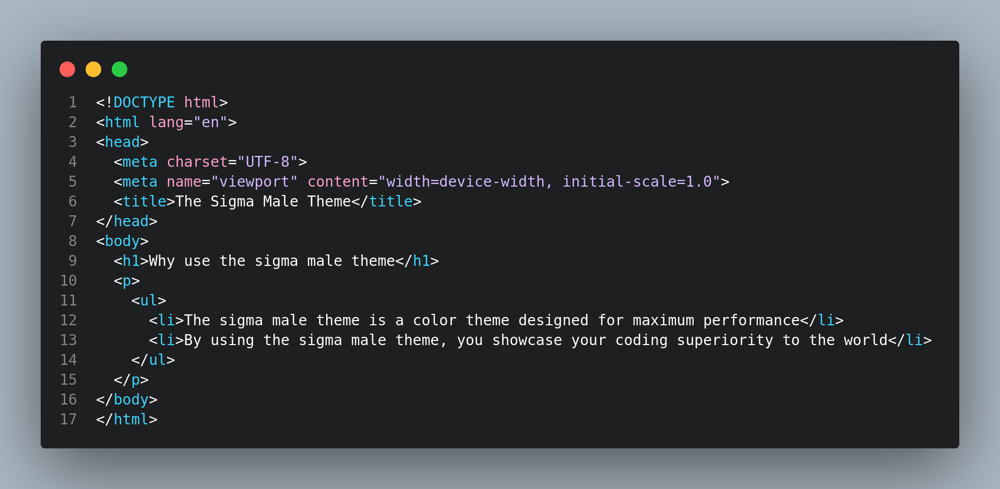
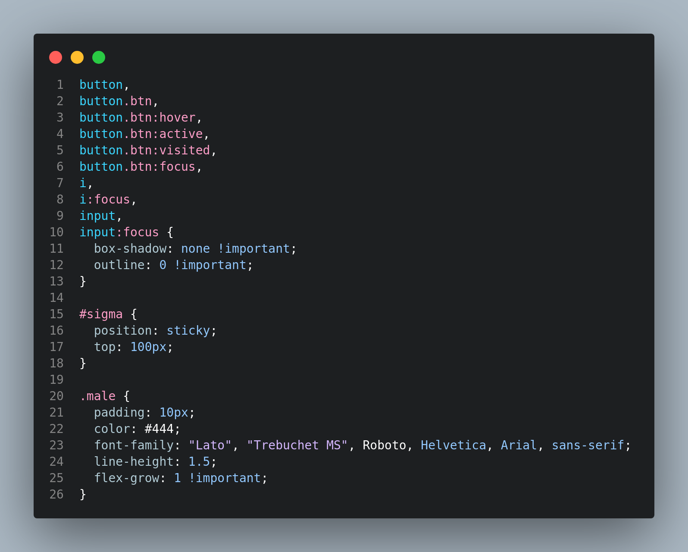
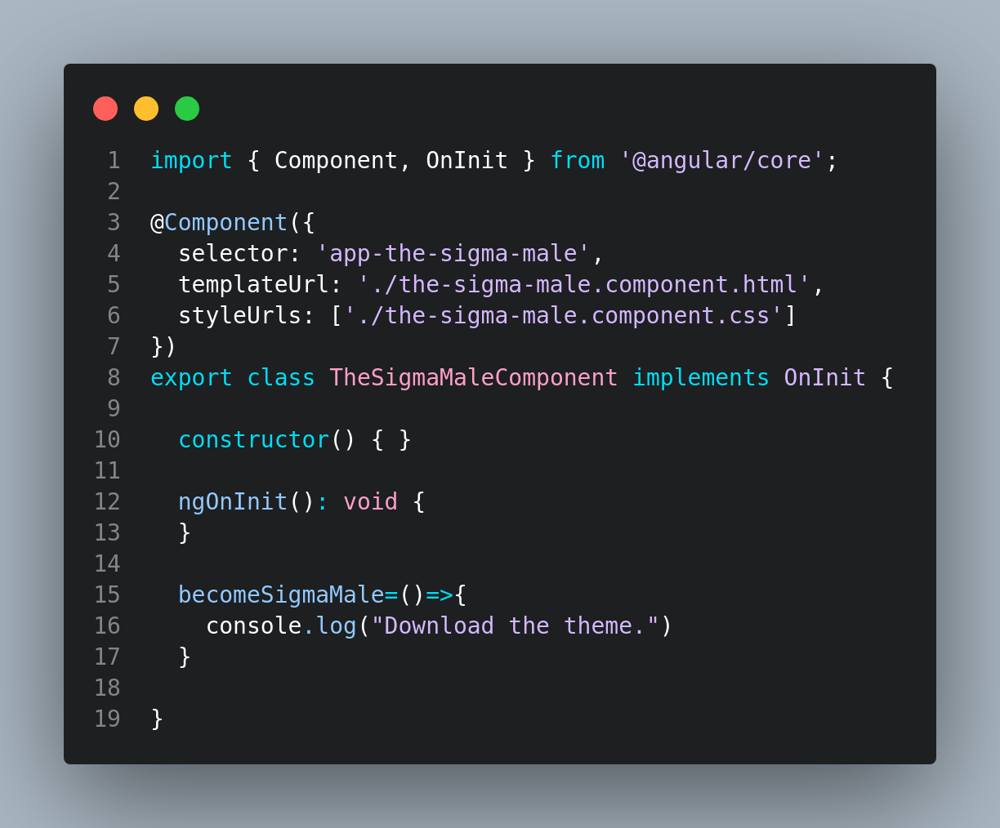

# [The Sigma Male Theme](https://marketplace.visualstudio.com/items?itemName=MohamedDerouiche.the-sigma-male-theme)

## Description

This is a vscode color theme for sigma males and elite coders.

## Prerequisites

To use this theme you need to: 

<ul>
<li>Be a man of culture</li>
<li>Goes to the gym every day and be able to do 30 pushups</li>
<li>Knows how to center a div</li>
<li>Knows how to exit VIM</li>
</ul>

## Install

If you don't know how to install a theme, you are not ready for this theme.

## Screenshots

### .html file:

### .css file:

### .ts file:

I'll be adding more screenshots for .json, .py,...

## [Documentation](https://youtu.be/dQw4w9WgXcQ?si=XSV0-Eck9lG5Z53x)

More detailed documentation can be found [here](https://youtu.be/dQw4w9WgXcQ?si=XSV0-Eck9lG5Z53x).

**Enjoy!**
